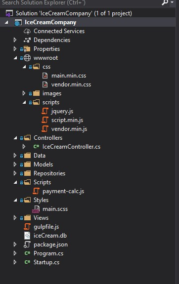
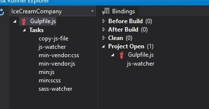

# Module 9: Client-Side Development

## Lab: Client-Side Development

1. **Nombres y apellidos:** Francisco Javier Moreno Quevedo
2. **Fecha:** 02/12/2020
3. **Resumen del Ejercicio:** Añadir estilo a la pagina de venta de helados utilizando bootstrap
4. **Dificultad o problemas presentados y como se resolvieron:** Ninguna

- Ejercicio 3 Using Bootstrap
  - Añadimos en la carpeta **Styles** el fichero **main.scss** que contendra los estilos de nuestra página
  - Añadimos los estilos
  - Creamos un fichero JavaScript **gulpfile.js** con las tareas de compilación
    - Añadimos una nueva tarea que compile el fichero  **vendor.css**
    - Añadimos una nueva tarea que minifique los ficheros de una carpeta del proyecto 
    - Añadimos dos  watcher uno lanza la tarea que compila los cambios del  **vendor.css** y otro que ejecuta la tarea que minifica 
    - Ejecutamos las tareas

Watchers ejecutandose

